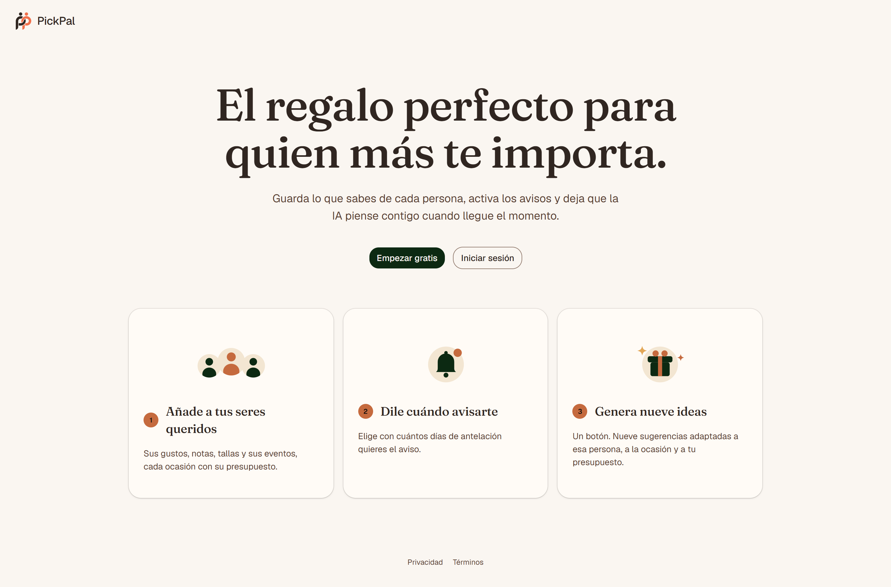
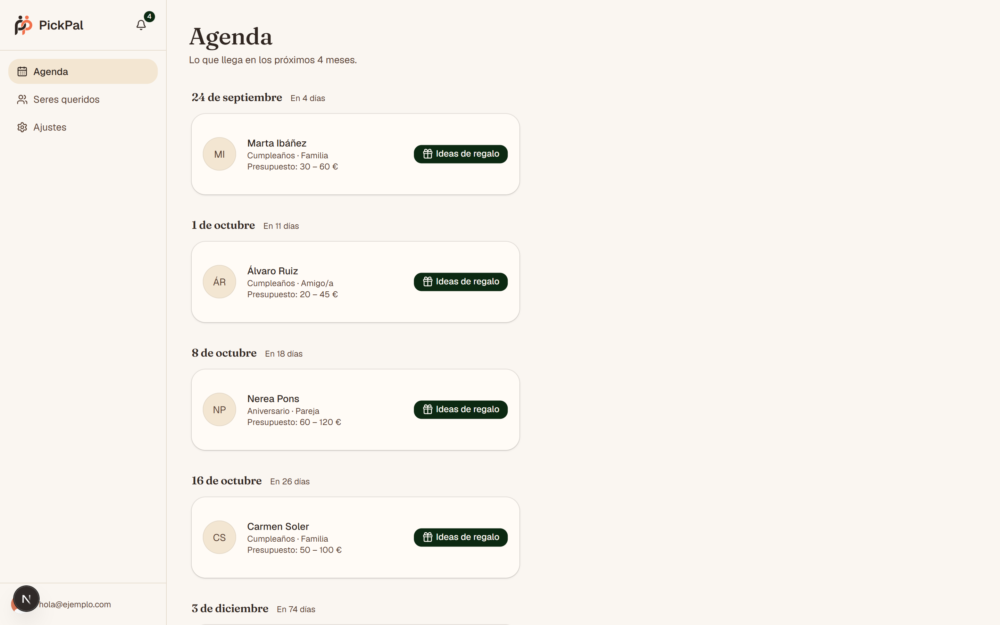
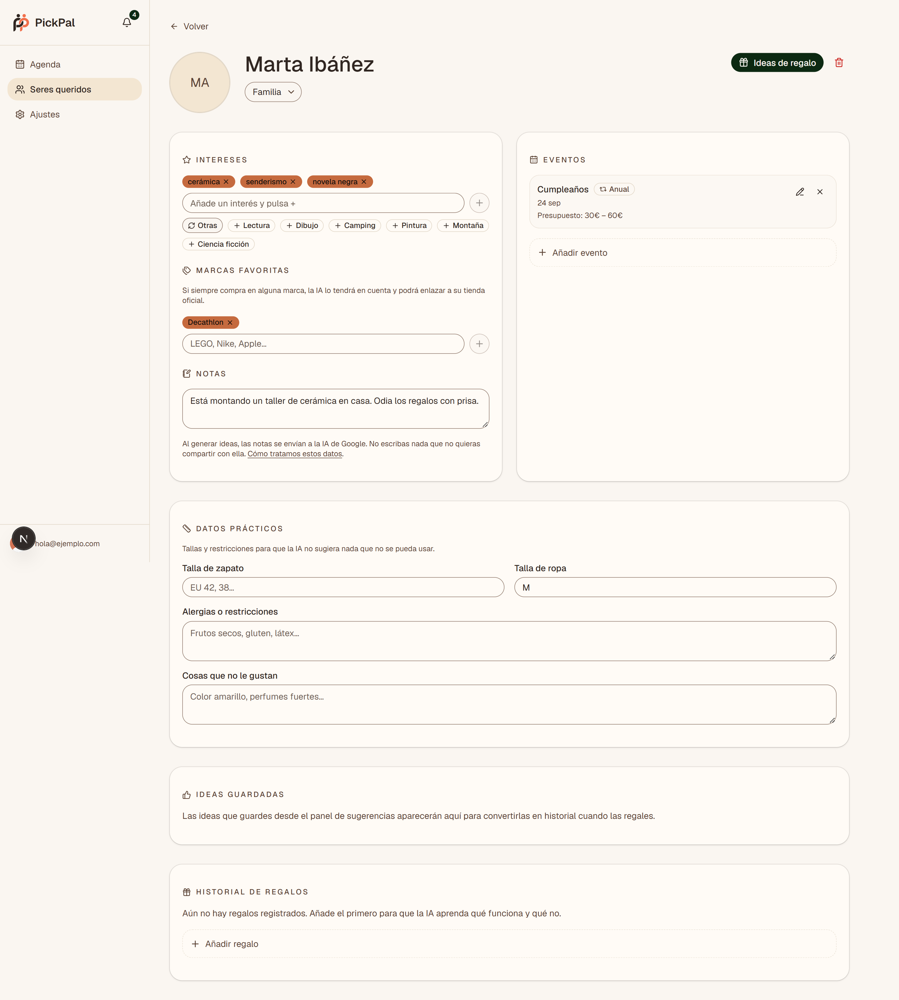
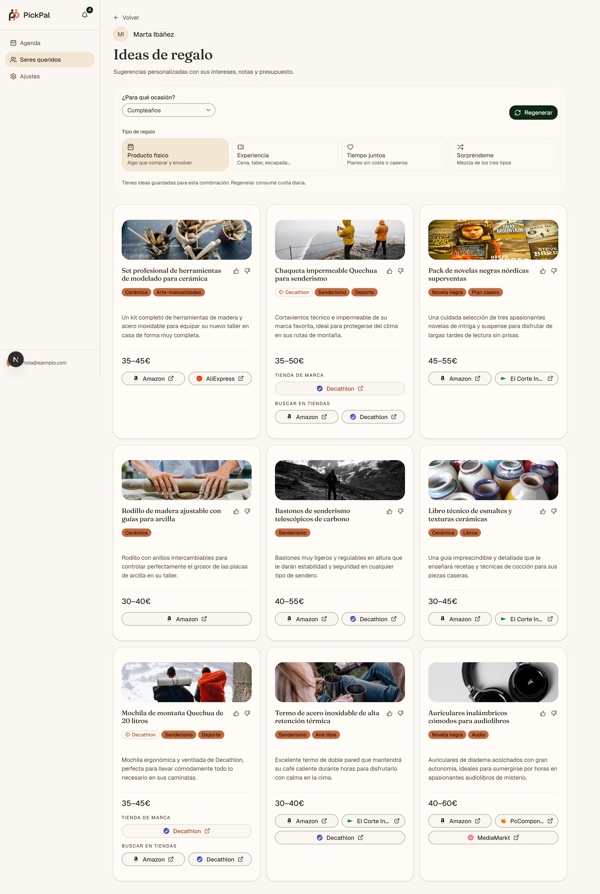

<div align="center">

<!-- logo-mark-email.svg es la variante crema del mismo símbolo; el verde
     desaparece sobre el fondo oscuro de GitHub, así que solo vale en claro. -->
<picture>
  <source media="(prefers-color-scheme: dark)" srcset="public/logo-mark-email.svg">
  
</picture>

# PickPal

**El regalo perfecto para quien más te importa.**

Guarda lo que sabes de cada persona, activa los avisos
y deja que la IA piense contigo cuando llegue el momento.

[](https://github.com/jm-fuster/PickPal/actions/workflows/ci.yml)
[](LICENSE)

**[Abrir la app](https://pickpal.jorgemolinafuster.com)**

[Read in English](README.md)

</div>

<br>

<picture>
  <source media="(prefers-color-scheme: dark)" srcset="docs/screenshots/landing-dark.png">
  
</picture>

<picture>
  <source media="(prefers-color-scheme: dark)" srcset="docs/screenshots/agenda-dark.png">
  
</picture>

## Qué es

Una libreta de la gente que te importa, con una función de IA encima. En ese orden.
Apuntas lo que sabes de alguien: qué le gusta, qué talla usa, a qué es alérgico, qué le
regalaste el año pasado y qué cara puso. Cuando se acerca una de sus fechas, PickPal te
avisa y puede convertir todo eso en ideas de regalo para esa persona, esa ocasión y ese
presupuesto.

Es un proyecto personal y lo uso de verdad.

## Qué hace

**Una agenda que solo enseña lo que viene.** `/agenda` lista los eventos de los próximos
cuatro meses ordenados por cercanía, agrupados bajo *Hoy*, *Mañana* o la fecha, y con
aviso visual en cuanto algo entra en los siete días. En pantallas anchas, pinchar un
evento abre el panel de ideas al lado; en las estrechas, te lleva a la página de ideas.
La campana de la cabecera enseña lo que cae dentro de tu ventana de aviso: 30 días por
defecto. El servidor acepta de 1 a 365, pero todavía no hay ninguna pantalla que exponga
ese control.

**Cada persona es una página de libreta.** Nombre, relación, hasta 20 intereses, hasta 10
marcas favoritas, notas libres, talla de ropa y de zapato, alergias, cosas que no le
gustan, y un avatar que se genera en vez de subirse. El campo de intereses autocompleta
contra un catálogo local de unos 130 intereses en 17 categorías (`src/lib/interests.ts`),
y está offline a propósito: así las sugerencias no gastan cuota del modelo y del
dispositivo no sale nada de esa persona para alimentarlas. Se edita campo a campo, con
autoguardado;
`/seres-queridos/[personId]/edit` existe solo como redirección a la ficha.



**Fechas e historial.** Cada fecha lleva etiqueta, día y mes, año opcional, una marca de
anual o puntual, y un presupuesto opcional en un deslizador de 0 a 500 €. El historial
guarda qué regalaste, en qué ocasión, en qué año, cómo sentó y las notas que quieras
poner. Ese historial vuelve a entrar en la siguiente generación.

**Ideas con el modelo atado corto.** Eliges la ocasión, eliges uno de los cuatro tipos de
regalo (*Producto físico*, *Experiencia*, *Tiempo juntos*, *Sorpréndeme*) y pulsas
**Generar 9 ideas**. La petición le pide nueve a Gemini 3.5 Flash y acepta entre seis y
nueve (`z.array(...).min(6).max(9)`, `src/lib/gifts.ts:122`); después descarta los títulos
repetidos. Cada idea se guarda con un pulgar arriba o se descarta con uno abajo, y al
descartar hay deshacer: cuando se confirma, se apuntan las categorías de esa idea para que
la siguiente tanda se aleje de ellas. Una idea guardada pasa al historial con **Lo regalé**.
Las tandas se cachean por usuario, persona, ocasión y tipo de regalo, así que volver a
abrir una que ya generaste no cuesta cuota.

<picture>
  <source media="(prefers-color-scheme: dark)" srcset="docs/screenshots/gifts-dark.png">
  
</picture>

**Enlaces a tiendas.** Las ideas de producto físico buscan en las tiendas que hayas
elegido en ajustes, acotadas a las que el modelo sugirió para esa idea y con vuelta a
todas tus favoritas si ninguna coincide, de once posibles: Amazon, El Corte Inglés,
AliExpress, Temu, Miravia, Decathlon, IKEA, PcComponentes, MediaMarkt, Zalando y Druni
(`STORE_IDS`, `src/lib/stores.ts`). Las de experiencia, tiempo juntos y sorpresa llevan
un único enlace de búsqueda.

**Avisos por email**, opcionales y apagados de fábrica, porque la base legal declarada es
el consentimiento. La antelación es un selector múltiple de 0, 2, 7 y 14 días, con `[14]`
por defecto, y cada usuario recibe un único correo agrupado por ejecución en vez de uno
por fecha.

**Ajustes** reúne el tema, los avisos, las tiendas favoritas, los enlaces legales y el
borrado de cuenta: escribes `ELIMINAR`, se purgan los datos de Convex y después se borra
el usuario de Clerk.

## Cómo se fabrica una idea

`POST /api/recommendations` es la parte de este repo que merece la pena leer primero.

```
POST /api/recommendations
 │
 ├─ src/proxy.ts ─────────── denegar por defecto + comprobación CSRF Sec-Fetch-Site
 ├─ auth() ───────────────── sesión de Clerk y, con ella, un JWT para Convex
 ├─ comprobación de env ──── 503 si falta GOOGLE_GENERATIVE_AI_API_KEY
 │                           o CONVEX_SERVER_SECRET
 ├─ zod ──────────────────── valida el cuerpo de la petición
 │
 ├─ 4 × fetchQuery ───────── persona · fecha y presupuesto · historial ·
 │  (en paralelo)            dislikedCategories de la tanda anterior
 │
 ├─ reservar cuota ─┐ ────── atómico, y antes de llamar al modelo
 │                  │
 ├─ generateObject ─┤ ────── gemini-3.5-flash, salida tipada con Zod, maxRetries: 2
 ├─ quitar repes ───┤
 ├─ enriquecer ─────┤ ────── foto de Pexels (4 s) · tienda vía Brandfetch (4 s / 2,5 s)
 │  (best effort)   │        las dos opcionales, las dos pueden fallar en silencio
 │                  │
 ├─ upsert ─────────┤ ────── Convex revalida cada campo en el servidor
 │                  │
 └─ 200 JSON        └─────── cualquier excepción de arriba devuelve la cuota reservada
```

Tres cosas de ese diagrama son el motivo de todo lo demás:

- **La cuota se reserva antes de llamar al modelo y se devuelve si algo revienta**, porque
  a esa altura no se ha persistido nada. Esto sustituyó a un comprobar-y-consumir que
  podía tener una condición de carrera.
- **El backend no se fía de la ruta.** `api.recommendations.upsert` revalida todos los
  campos que ha producido el modelo, de manera que una ruta comprometida sigue sin poder
  escribir basura en la base de datos.
- **Los fallos del proveedor se traducen, no se reenvían.** Se clasifican en 503,
  429-diario, 429-por-minuto o 500, con un texto en español que el usuario pueda leer, y
  el cuerpo de la respuesta del proveedor no llega nunca al navegador.

### La autorización, tres veces

1. **`src/proxy.ts`.** Next 16 renombró `middleware.ts` a `proxy.ts`, y `npm run build` lo
   imprime como `ƒ Proxy (Middleware)`. Ejecuta `clerkMiddleware` con un matcher que
   deniega por defecto: solo `/`, `/sign-in(.*)`, `/sign-up(.*)`, `/privacidad` y
   `/terminos` son públicas, y todo lo demás pasa por `auth.protect()`. Así una ruta nueva
   se queda privada por descuido en lugar de quedarse pública por descuido. Además
   responde 403 a las peticiones no-GET a `/api` cuya cabecera `Sec-Fetch-Site` diga que
   vienen de otro origen.
2. **`auth()` en los route handlers**, con `ConvexProviderWithClerk` en el navegador.
3. **`requireUser(ctx)` en cada función de Convex**, seguido de la comprobación de
   propiedad por documento contra `clerkUserId`.

Clerk llega a Convex por una plantilla JWT llamada `convex`, que `convex/auth.config.ts`
valida contra `CLERK_JWT_ISSUER_DOMAIN` con `applicationID: "convex"`. `requireUser`
devuelve `identity.subject`, desnormalizado como `clerkUserId` en ocho de las nueve tablas
—`importantDates` es la excepción, porque cuelga de la persona a la que pertenece—.
`SessionGuard` es una redirección de cortesía para una sesión que ha desaparecido, y no una
frontera de seguridad.

### Límites de uso

Dos sistemas independientes y cuatro cubos:

| Cubo | Límite | Dónde |
| --- | --- | --- |
| Generaciones de IA | 10 por usuario y día UTC | `recommendationUsage` |
| `create_person` | 50 al día | `rateLimitBuckets` |
| `create_date` | 100 al día | `rateLimitBuckets` |
| `save_idea` | 50 al día | `rateLimitBuckets` |

El contador de generaciones es fail-closed, y sus mutations `reserve` y `refund` están
protegidas por el `CONVEX_SERVER_SECRET` compartido, así que un cliente autenticado desde
el navegador no puede llamar a `refund` y resetearse la cuota.

### Datos y trabajos

Nueve tablas en Convex: `people`, `importantDates`, `userSettings`, `emailNotifications`,
`recommendationUsage`, `rateLimitBuckets`, `recommendations`, `savedIdeas`, `giftHistory`.

Un solo cron: `"send daily birthday email reminders"`, `0 8 * * *`, que ejecuta
`internal.emails.runDailyEmailNotifications`. Recorre los usuarios uno a uno, manda a cada uno el HTML
agrupado por la API REST de Resend sin usar su SDK, y escribe filas de deduplicación por
fecha, año de la ocurrencia y antelación, para que un reinicio no envíe dos veces el mismo
aviso.

## Stack

Next.js 16 (App Router) · React 19 · TypeScript 6 · Tailwind CSS 4 ·
[Convex](https://convex.dev) 1.46 · [Clerk](https://clerk.com) 7 ·
[AI SDK](https://sdk.vercel.ai) 7 con Google Gemini 3.5 Flash · Zod 4 · react-hook-form ·
primitivas de [Base UI](https://base-ui.com) siguiendo las convenciones de shadcn ·
next-themes · Resend · Vitest.

No hay capa de i18n: la interfaz es solo en español, las rutas son palabras en español y
al modelo se le habla en español.

## Ejecutarlo en local

Node 22 o superior, declarado una sola vez en `.nvmrc` y espejado por `engines` en
`package.json`. CI lee ese mismo archivo en vez de fijar su propia versión.

Primero las cuentas, y después deja que `npx convex dev` enlace el proyecto antes de poner
nada del lado de Convex: `npx convex env set` saca `CONVEX_DEPLOYMENT` de `.env.local` y
sin él sale con «No CONVEX_DEPLOYMENT set». O sea: enlazar, poner las dos variables de
Convex, y volver a lanzar `npx convex dev`.

1. Crea una aplicación gratis en [Clerk](https://clerk.com) y copia la publishable key y
   la secret key.
2. En Clerk, ve a **Configure → JWT Templates** y crea una desde el preset **Convex**, y
   copia su Issuer. Si quieres los avisos por email, añade también un claim `email` a esa
   plantilla (`"email": "{{user.primary_email_address}}"`): Convex saca la dirección del
   token (`identity.email` en `convex/settings.ts`), y sin el claim el cron no tiene a
   quién escribir y se queda callado.
3. Crea un proyecto gratis en [Convex](https://convex.dev).
4. Saca una API key de [Google AI Studio](https://aistudio.google.com). La cuota se cuenta
   **por proyecto** y no por key, así que usa un proyecto tuyo.

Después:

```bash
git clone https://github.com/jm-fuster/PickPal.git
cd PickPal
npm install
cp .env.example .env.local        # rellénalo: ver Configuración, más abajo
```

Enlaza el proyecto de Convex. Este primer push falla con «Environment variable
CLERK_JWT_ISSUER_DOMAIN is used in auth config file but its value was not set»: es lo
esperado, y lo arreglan los dos comandos de después.

```bash
npx convex dev --once     # escribe CONVEX_DEPLOYMENT y NEXT_PUBLIC_CONVEX_URL en .env.local
```

Genera el secreto compartido y guarda el valor, porque va en dos sitios:

```bash
node -e "console.log(require('node:crypto').randomBytes(32).toString('hex'))"
```

Pon esa cadena de 64 caracteres en `CONVEX_SERVER_SECRET` dentro de `.env.local`, y dale
el mismo valor a Convex:

```bash
npx convex env set CLERK_JWT_ISSUER_DOMAIN https://tu-issuer.clerk.accounts.dev
npx convex env set CONVEX_SERVER_SECRET pega-aqui-el-mismo-valor
```

Y ahora dos terminales, las dos abiertas:

```bash
npx convex dev    # sigue vigilando y subiendo convex/ mientras trabajas
```

```bash
npm run dev       # http://localhost:3000
```

**Qué funciona con solo Clerk y Convex configurados:** la agenda, las personas, las fechas,
las ideas guardadas y el borrado de cuenta. `POST /api/recommendations` responde 503 hasta
que estén las claves de IA, y los emails no se envían nunca, sin avisar. Es el modo de
fallo previsto y no una instalación rota.

## Configuración

Las variables viven en tres sitios distintos, y mezclarlos es la forma habitual de perder
una tarde.

**Next.js** — `.env.local` en local, ajustes del proyecto en Vercel:

| Variable | Obligatoria | Notas |
| --- | --- | --- |
| `NEXT_PUBLIC_CLERK_PUBLISHABLE_KEY` | sí | Clerk → API keys (`pk_test_…`) |
| `CLERK_SECRET_KEY` | sí | Clerk → API keys (`sk_test_…`) |
| `NEXT_PUBLIC_CLERK_SIGN_IN_URL` | sí | `/sign-in` |
| `NEXT_PUBLIC_CLERK_SIGN_UP_URL` | sí | `/sign-up` |
| `NEXT_PUBLIC_CLERK_SIGN_IN_FALLBACK_REDIRECT_URL` | sí | `/agenda` |
| `NEXT_PUBLIC_CLERK_SIGN_UP_FALLBACK_REDIRECT_URL` | sí | `/agenda` |
| `NEXT_PUBLIC_CONVEX_URL` | sí | la escribe `npx convex dev` |
| `CONVEX_DEPLOYMENT` | sí | la escribe `npx convex dev` |
| `CONVEX_SERVER_SECRET` | sí | **El mismo valor tiene que estar también en Convex.** Si falta aquí, `/api/recommendations` responde 503; si está pero no coincide con el de Convex, responde 429 `No autorizado.` |
| `GOOGLE_GENERATIVE_AI_API_KEY` | sí | aistudio.google.com |
| `PEXELS_API_KEY` | no | fotos en las tarjetas de ideas; si falta, degrada sin ruido |
| `BRANDFETCH_CLIENT_ID` | no | enlaces a la tienda de la marca; igual |

**El deployment de Convex** — `npx convex env set NOMBRE valor`, con `--prod` para
producción:

| Variable | Obligatoria | Notas |
| --- | --- | --- |
| `CLERK_JWT_ISSUER_DOMAIN` | sí | el Issuer de la plantilla JWT `convex` |
| `CONVEX_SERVER_SECRET` | sí | el mismo valor que en Next.js |
| `RESEND_API_KEY` | para email | `convex/emails.ts` lanza si falta |
| `EMAIL_FROM` | no | cae a un `PickPal <…>` por defecto |

**Solo en Vercel** — `CONVEX_DEPLOY_KEY`. Se genera en el dashboard de Convex, no desde el
CLI.

<details>
<summary><strong>Desplegar en Vercel y Convex</strong></summary>

1. Importa el repositorio en Vercel.
2. Mete en **Settings → Environment Variables** las variables de la tabla de Next.js,
   todas menos `CONVEX_DEPLOYMENT` y `NEXT_PUBLIC_CONVEX_URL`, que son solo locales: la
   URL la pone el propio build a partir de `CONVEX_DEPLOY_KEY`.
3. Cambia el build command a `npx convex deploy --cmd 'npm run build'` y añade
   `CONVEX_DEPLOY_KEY`.
4. Añade el dominio que te asigne Vercel en **Clerk → Domains**, y apunta
   `CLERK_JWT_ISSUER_DOMAIN` a tu instancia de producción de Clerk.
5. **Antes del primer build**, pon las variables del lado de Convex contra producción
   desde tu máquina: `npx convex env set CLERK_JWT_ISSUER_DOMAIN <issuer de prod> --prod`
   y `npx convex env set CONVEX_SERVER_SECRET <el mismo valor que le diste a Vercel> --prod`.
   Hasta que existan, cada build muere en `npx convex deploy` con la misma comprobación de
   auth config que en local. Si ya has hecho push, ponlas y vuelve a desplegar.

`CONVEX_DEPLOY_KEY` decide a qué deployment de Convex apunta el build **y** sobrescribe
`NEXT_PUBLIC_CONVEX_URL` durante el build, así que cambiar solo la URL no te mueve de
deployment.

Cada push a `main` redespliega. `vercel.json` se salta los builds de Vercel en las ramas
`dependabot/*`, porque CI ya las cubre.

</details>

## El sistema de diseño

La parte a la que más cariño tengo y la que no se ve desde fuera: el sistema de diseño se
comprueba contra el código en lugar de describirse y ya está.

`npm run token-map` ejecuta `scripts/token-map.mjs`, que cruza un volcado de las variables
de Figma guardado en el repo (`design/figma-tokens.snapshot.json`) con las custom
properties reales de `src/app/globals.css`, escribe la tabla de correspondencias en
[`docs/token-map.md`](docs/token-map.md) y sale con código distinto de cero **solo** cuando
aparece una divergencia, una entrada obsoleta del registro o un conflicto que no esté
declarado en `design/token-divergences.json`. Una
comprobación que está siempre en rojo enseña a ignorarla, así que todo lo que decidimos
tolerar tiene que estar escrito con su motivo al lado. Ahora mismo: 71 variables
espejadas y cero divergencias sin declarar.

Otras dos cosas que salieron de hacerlo bien:

- Cada token de color de [`docs/design-system.md`](docs/design-system.md) lleva su ratio
  de contraste medido, no una opinión.
- `--primary` se partió en `--primary` y `--brand`, y `--secondary` en `--secondary` y
  `--brand-secondary`, porque un solo token estaba intentando cumplir dos requisitos de
  WCAG que se contradecían.

Sobre accesibilidad, la versión honesta: el enlace de salto existe
(`src/app/(app)/layout.tsx`, `href="#contenido"`), el archivo de Figma cumple AA y el
código ya lo ha alcanzado, `aria-live` aparece en tres sitios —cinco regiones vivas si
cuentas los `role="status"` sueltos— y no en todos los que podría, y el linter todavía
marca dos `` crudos de los avatares generados.

## Puertas de calidad

```bash
npm test        # 176 tests en 13 archivos
npm run lint
npm run build
```

CI (`.github/workflows/ci.yml`) corre en cada push a `main` y en cada pull request, sobre
Node 22: `npm ci`, `npx tsc --noEmit`, `npx tsc -p convex/tsconfig.json --noEmit` y después
`npm test`. Ese segundo typecheck está porque Convex tiene su propio tsconfig: sin él, los
errores de tipos que solo existen en Convex pasan CI y revientan el deploy de Vercel. Un
segundo job hace auto-merge en squash de los bumps patch y minor de Dependabot cuando el
primero está en verde.

CI todavía no pasa el linter ni `next build`, así que esos dos corren de tu cuenta antes de
hacer push.

## Documentación

| Archivo | Qué es |
| --- | --- |
| [`docs/security.md`](docs/security.md) | El modelo de confianza, ocho patrones obligatorios, un checklist de PR según la ruta que toques, una sección explícita de «esto todavía no está y por qué», y un post-mortem de Dependabot |
| [`docs/ia-regalos.md`](docs/ia-regalos.md) | La tubería de IA y sus tres capas de defensa. Desactualizado en las rutas y en el número de tiendas: fíate del código |
| [`docs/email-notifications.md`](docs/email-notifications.md) | El cron diario de punta a punta, y por qué el interruptor sale apagado |
| [`docs/tech-stack.md`](docs/tech-stack.md) | Por qué Convex y no Prisma, Clerk y no NextAuth, Resend sin su SDK. La entradilla aún dice «Next.js 14+» |
| [`docs/figma-tokens.md`](docs/figma-tokens.md) | El reglamento del archivo de Figma: modelo de cuatro capas, reglas de alias, y que ninguna variable nace sin descripción |
| [`docs/token-map.md`](docs/token-map.md) | Lo genera `npm run token-map` |
| [`docs/design-system.md`](docs/design-system.md) | Un registro de decisiones: 2.193 líneas, sin índice, y con un diario de trabajo fechado en su segunda mitad. Bueno para el porqué, malo para consultar un token |

[`AGENTS.md`](AGENTS.md) y [`CLAUDE.md`](CLAUDE.md) son el reglamento de este proyecto para
quien contribuye. Son cortos, y están para señalar los tres documentos que hay que leer
antes de tocar seguridad, tokens o el sistema de diseño.

Algunos archivos de `docs/` son anteriores a las rutas actuales y sobreviven solo como
historia. Las rutas de este README salieron de `npm run build`.

## Contribuir

Los issues y los PR son bienvenidos. Si es algo grande, abre antes una issue para acordar
la forma. Mira [`CONTRIBUTING.md`](CONTRIBUTING.md), aunque ahora mismo está
desactualizado en varios puntos que este README corrige.

## Créditos

El código es MIT. Parte de lo que viaja con él no es mío:

- **Los avatares.** El estilo *dylan* de DiceBear, que es un remix de un archivo de Figma
  Community de **Natalia Spivak**, usado bajo
  [CC BY 4.0](https://creativecommons.org/licenses/by/4.0/). PickPal lo pinta para cada
  persona, así que el crédito va aquí y no solo en un documento.
- **Los logos de tiendas** de `public/stores/` son marcas de sus dueños y se usan para
  identificarlas.
- **Las fotos** de las tarjetas de ideas vienen de Pexels y se acreditan en la app.
- **La tipografía** es Geist en la interfaz y Fraunces en los títulos.

## Licencia

[MIT](LICENSE) © Jorge Molina Fuster
